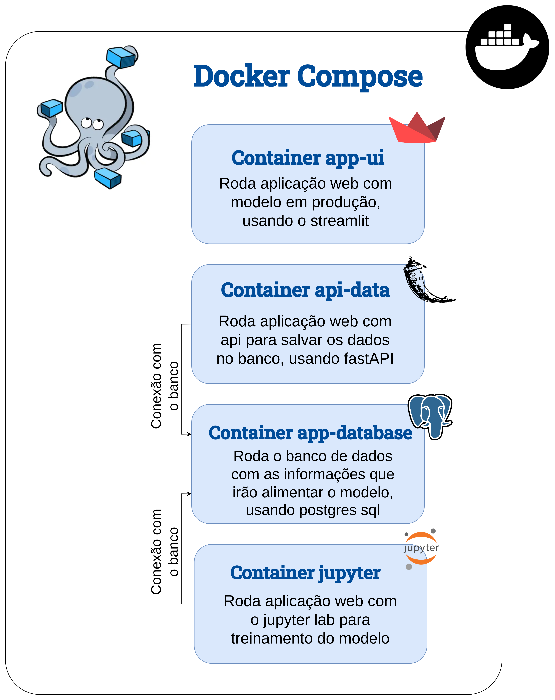
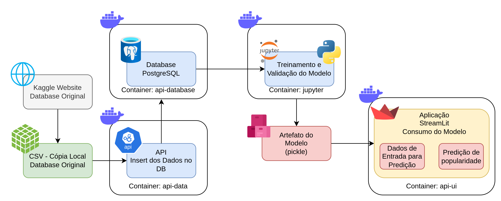

## Tech Challenge #3 **🧩**

🎯Objetivo: Previsão de popularidade de músicas do Spotify via classificação binária (popular vs. não-popular).

### **Tecnologias utilizadas 💡**

Nós utilizamos 4 containers em Docker para isolamento dos ambientes:
* app-ui: aplicação web streamlit que roda o modelo
* api-data: API de ingestão dos dados (CSV -> Postgres)
* app-database: host do banco de dados Postgres SQL
* jupyter: servidor com jupyter notebook para treinamento do modelo.

A imagem abaixo traz a visão dos containers de forma mais detalhada.
<!--  -->


A arquitetura da nossa solução pode ser vista na imagem abaixo.
<!--  -->


Nela, verificamos que os dados, originalmente do Kaggle, são salvos no formato csv localmente. Então, a API de ingestão de dados faz o carregamento desses dados para o Banco de Dados Postgres SQL. 

Os dados armazenados no Postgres DB são lidos dentro do Jupyter Notebook, e então utilizados para todas as etapas de construção do modelo, desde a análise exploratória dos dados, até o treinamento e validação. Como resultado, o modelo campeão é salvo como um artefato (pickle). 

O artefato de modelo é carregado pela aplicação web em streamlit, que fará o consumo do modelo a partir de dados de entrada inseridos pelo usuário.

---

### Estrutura de pastas **📂**

---

* **app**: Armazena os arquivos relativos à aplicação (streamlit)
* **docker**: Contém todos os dockerfiles responsáveis pela criação de cada um dos containers
* **docs**: Contém diagramas, imagens e demais arquivos para documentação
* **src**: Possui os dados brutos no formato CSV e os módulos de interface com o banco de dados (Postgres) para o carregamento dos dados
* **training_model**: Possui todos os jupyter notebooks utilizados para as análises, treinamento e validação do modelo. O notebook principal, que serve também como documentação base, é o `training_model.ipynb` na raiz deste diretório.


```
tech_challenge_3
├── app
│   ├── main.py
│   └── requirements.txt
├── docker
│   ├── fastapi
│   │   └── Dockerfile
│   ├── jupyter
│   │   └── Dockerfile
│   └── streamlit
│       └── Dockerfile
├── docker-compose.yml
├── docs
│   ├── architeture.png
│   ├── containers.png
│   ├── DesignOfExperiments.drawio
│   └── infra_tech3.drawio
├── README.md
├── src
│   ├── data
│   │   └── spotify_raw_dataset.csv
│   ├── interfaces
│   │   ├── db_definitions.py
│   │   ├── db_interfaces.py
│   │   ├── __init__.py
│   │   ├── __pycache__
│   │   │   ├── db_definitions.cpython-312.pyc
│   │   │   ├── db_interfaces.cpython-312.pyc
│   │   │   └── __init__.cpython-312.pyc
│   │   └── test_db_interfaces.py
│   ├── mainlog.log
│   ├── main.py
│   ├── __pycache__
│   │   └── main.cpython-312.pyc
│   └── requirements.txt
└── training_model
    ├── chrys
    │   └── training_model_spotify.ipynb
    ├── interfaces
    ├── raiane
    │   ├── training_model_spotify.ipynb
    │   └── training_model_spotify_v2.ipynb
    ├── requirements.txt
    ├── test_connect_db.ipynb
    └── training_model.ipynb
```

### Início rápido 🚀

---

1. Certifique-se de que você possui uma instalação Docker funcionando.
2. Vá na raiz do projeto (ou seja, na raíz de `tech_challenge_3`) e rode o comando `docker compose up --build -d`. A criação dos containers demora em torno de 5 minutos, mas pode variar dependendo das configurações do seu computador.
3. Certifique-se de que os containers estão com state `running`.
4. Certifique-se que você tem os endereços e portas de rede mapeadas para o uso da chamada via `localhost`.
5. Faça um teste, acessando o Swagger API de Carregamento dos Dados no endereço `http://localhost/8000/docs`. Aqui, você pode testar a conexão com o Database Postgres também. Você também pode acessar o Jupyter Server no endereço `http://localhost/8888/`, caso deseje.
6. Acesse a aplicação no endereço `http://localhost/8501/`. Insira os dados desejados da sua música e verifique a predição de popularidade dela.

### Demos ⚒️

---

Clique [aqui](colocar link do drive) e assita a demo.
